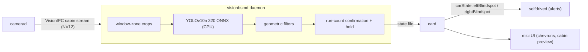

# VBSM — Vision Blind Spot Monitor

A camera-based blind spot monitor for the comma 4 running [sunnypilot](https://github.com/sunnypilot/sunnypilot), built for cars that have **no factory blind spot sensors**. It uses the device's interior (cabin-facing) camera — which sees through the rear side windows — to detect vehicles sitting in the adjacent lanes, and feeds the result into openpilot's native blind spot plumbing: chevron warnings in the UI, an optional chime, and lane-change awareness, exactly as if the car had radar BSM.

Everything runs on-device, on the CPU, alongside stock sunnypilot. No cloud services are involved, and in-cabin video is explicitly prevented from ever leaving the device (see [Privacy](#privacy)).

## Architecture

The daemon (`openpilot/sunnypilot/vision_bsm.py`) publishes per-side blind spot state to a small state file. `card` folds that into the standard `carState.leftBlindspot` / `rightBlindspot` fields, so every downstream consumer — alerts, UI chevrons, lane change logic — reacts natively without knowing the signal came from a camera.

## Detection pipeline

- **Zones**: the two rear side windows are hand-traced once as polygons in a JSON calibration file (`/data/vision_bsm.json`). Its presence is also the feature's on/off switch — no file, no daemon.
- **Model**: a YOLOv10n fine-tuned at 320 px on real window crops from the actual camera position (`/data/vbsm_models/vbsm320.onnx`), ~4× faster than the stock 640 model on the comma 4's CPU (roughly 140–220 ms per inference). Class ids and input size are read from the ONNX metadata; if the fine-tuned model is absent the daemon falls back to a stock COCO model. The GPU is never touched — it belongs to the driving model.
- **Crops**: one padded crop per run, alternating between tight (pad 0.0) and loose (pad 0.30) framing so consecutive runs see both context and detail at half the cost of running both every time.
- **Geometric filters**:
  - a detection must overlap the window glass by ≥ 30% (rejects reflections and interior objects),
  - boxes covering > 95% of the crop are rejected (the ego car's own body),
  - person-class detections are tracked separately so a driver or passenger leaning into the zone is never reported as a vehicle.
- **Per-side thresholds**, calibrated from hand-labeled on-road frames (the two windows have different optics and occlusion).

## Making it road-worthy

The parts that took real drives to get right:

- **Run-count confirmation, not wall-clock**: a warning needs a hit in this run *and* the previous run on that side (one miss tolerated, capped at 12 s between). Inference on CPU is the bottleneck, so any time-window scheme silently dies when the system is loaded — this was measured, not guessed.
- **Fast-overtaker bypass**: a single very confident hit (score ≥ 0.45) fires immediately. A car that closes fast can be visible for barely a second; two-run confirmation would coin-flip it.
- **Adaptive hold**: a confirmed warning is held for 1.5× the currently observed inference gap (clamped 1.2–4.0 s), so the chevron doesn't flicker when the system is slow.
- **Cadence by urgency**: checks every 0.25 s while signalling, 0.75 s when moving, 1.5 s idle — and while a turn signal is on, *all* inference budget goes to the signalled side.
- **Crash containment**: real VisionIPC buffers have alignment padding between planes; a malformed frame costs one frame, never the process. The daemon monitors its own RSS and exits cleanly (to be respawned) rather than pressuring the driving stack.

## UI integration

While a turn signal is active, the road view swaps to the cabin camera so the driver can see the blind spot itself, then returns when the signal ends. This needed three fixes beyond the naive version: a staleness guard on vehicle state, cancellation of in-flight stream switches (the base view cannot retarget mid-switch), and a hysteresis band that can never latch on the cabin stream. Chevron overlays and the chime are configurable from the settings UI.

## Training pipeline (all local)

The detector is fine-tuned with a **teacher–student** loop on the owner's own drives, on a local GPU workstation:

1. Full-resolution cabin footage is archived from the device to a local machine on the home network — nothing goes to any cloud.
2. A large teacher model (YOLOv10x) labels window crops sampled at 1 Hz, with a persistence filter to drop single-frame phantoms.
3. Hand-labeled frames from real drives are held out for evaluation — with a ±5 s leak fence around every labeled timestamp so training never sees evaluation neighborhoods.
4. YOLOv10n is fine-tuned at 320 px and exported to ONNX. A candidate model ships to the device **only if it beats the currently deployed model on the held-out labels**.

## Privacy

In-cabin video is treated as private by construction, enforced in code (marker `VBSM_PRIVACY`):

- The remote-command handler refuses any requested upload of driver-camera files, regardless of who asks — this covers both comma connect and sunnylink, which share the same dispatcher.
- The video-clips feature refuses to create clips from the driver camera.
- The background uploaders never sent cabin video in the first place (verified in code: only text logs and low-res road camera are auto-uploaded).
- Training data never leaves the owner's LAN.

The daily port workflow (below) verifies these guards are present in every published build and fails loudly if they ever go missing.

## Maintenance: surviving upstream

sunnypilot's staging branch is routinely **force-pushed with rewritten history**, so this mod is never rebased. Instead, a scheduled GitHub workflow ports it **by content**: it overlays the managed files onto the current upstream staging tree as a merge commit, gated by a manifest (`.github/vbsm-base.json`) that records the exact upstream base the files were last reconciled against. If upstream touches any managed file, the workflow refuses to guess and fails loudly; the drift is then merged by hand, the manifest base is advanced, and the port resumes. Each published build is verified before push: every mod marker must be present, the tree must stay prebuilt, and the daemon must compile.

Managed files:

| File | Role |
|---|---|
| `openpilot/sunnypilot/vision_bsm.py` | the detection daemon |
| `openpilot/system/manager/process_config.py` | daemon registration (onroad-only, gated on the calibration file) |
| `openpilot/selfdrive/car/card.py` | folds BSM state into `carState` |
| `openpilot/selfdrive/selfdrived/selfdrived.py` | alert plumbing |
| `openpilot/selfdrive/ui/mici/layouts/settings/toggles.py` | settings UI |
| `openpilot/selfdrive/ui/mici/onroad/augmented_road_view.py` | cabin-camera preview while signalling |
| `openpilot/system/athena/athenad.py` | privacy guards (`VBSM_PRIVACY`) |
| `openpilot/sunnypilot/modeld_v2/modeld.py` | temporary upstream compatibility fix (`VBSM_COMPAT`) |

## Measured dead ends

Approaches that were implemented, measured on real drives, and rejected — kept here so they aren't retried blindly:

- **Box-size gating** for parked cars: parked cars in the window subtend the same range of sizes as genuine threats.
- **Box-velocity / ego-speed gating**: cars being overtaken sweep through the window exactly like a parked row does at the same ego speed.
- **Batched inference** (both crops in one ONNX call): ~2× the cost of two single calls on this CPU, and dynamic-batch export scrambles the model's post-processed outputs.
- **Threshold tuning as a fix for parked rows**: false fires from dense parked rows score in the same band as real vehicles; only better training data or lane context separates them.

## Limitations

- Dense **parked rows** alongside the lane can still fire the indicator.
- The system needs a clear view through the rear side windows — a sunshade or heavy tint on a window disables detection on that side in practice.
- Validated in daylight driving; low-light performance is not yet characterized.
- This is a **driver aid**, not a safety system. It supplements — never replaces — mirror and shoulder checks.
